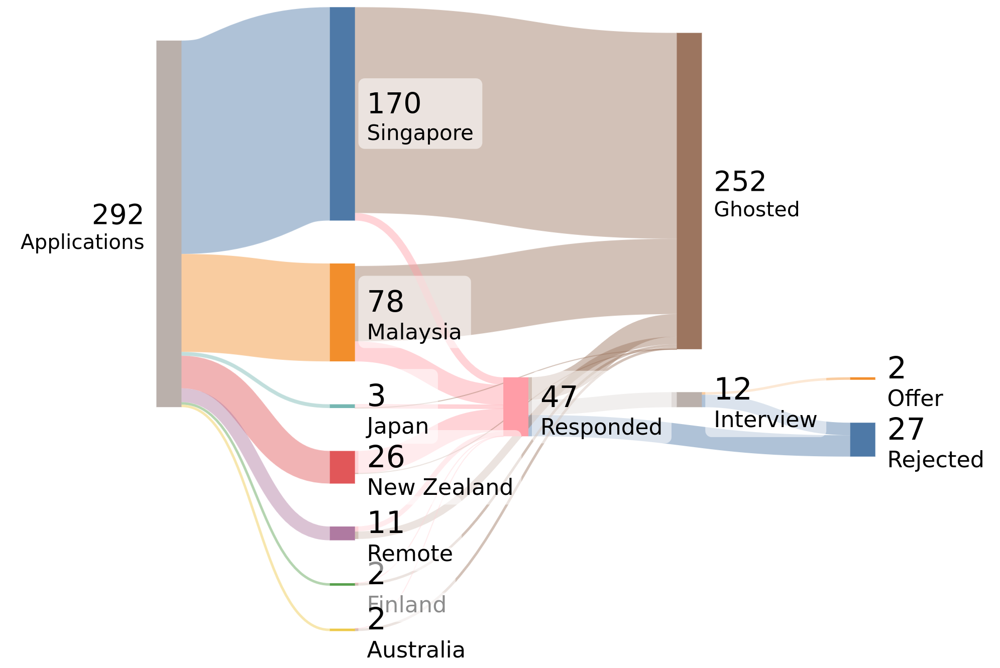

It's a dream of a lot of Malaysians to find work in Singapore - mostly due to the 3.5 exchange rate, and I was one of those people.

So equipped with 3 years of software development experience, and freshly out of university I went hunting for a job in Singapore for about 4 months. Here are my experience.

**TLDR:** As of March 2025, the Singaporean tech market is really hard to get into, even for locals.

# Introducing Myself
A bit of context about myself, I am a self taught software engineer who worked for about 3 years in the fintech industry before I decided to take a break from work in form of a university degree. Well,that's only partially true; I also wanted a degree to work overseas. 

So it was a good opportunity to heal from my burnout and progress my career. I end up graduating with a degree in Information Systems Engineering from Universiti Tunku Abdul Rahman (UTAR) on November 2024. This was when I started looking for a job.

# My Plan
The best plan of action for my current situation was to apply for jobs in Singapore while I was still in Malaysia with the hope to get a job offer before I actually move there.

I can't exactly just move there without an employment permit, and neither do I want to go job hunting in Singapore daily. It's going to eat capital that I do not have.

So I continued with the best plan of action.

## Target Market
As per the title, I am targeting jobs in Singapore but I also wanted to keep my options open, so I decided to apply for jobs in a few other countries which are:

- Malaysia
- Finland
- Japan
- New Zealand
- Australia

Though everything except for Singapore and Malaysia is more due to curiousity than any actual serious-ness.

This serves as a really good way to compare the job markets in these countries. It also became an unintentional A/B test of sorts.

## Target Portals
In Malaysia, we tend to use [LinkedIn](https://www.linkedin.com/), and [JobStreet](https://my.jobstreet.com/). This would be the same with Singapore, as well as New Zealand, and Australia. For Japan, I used a site called [JapanDev](https://japan-dev.com/japan-jobs-relocation) which is catered specifically for foreigners, and for Finland I used [GlassDoor](https://www.glassdoor.com/Job/finland-software-engineer-jobs-SRCH_IL.0,7_IN79_KO8,25.htm).

# The Hunt

## Data Summary

Over a period of 4 months (starting November 2024), I applied to 292 jobs in total, with:

- 170 of them in Singapore
- 78 in Malaysia
- 26 in New Zealand
- 3 in Japan
- 2 in Finland
- 2 in Australia

The other 11 were for remote global roles. All of these were tracked in Google Sheet.

## Experience

### November & December 2024
The first month (November 2024) was a bit of a shock. Back when I was working in 2020, I was getting responses and interviews within a week or two of applying. But this time, I was getting only around 15 responses for the 58 applications I sent out.

Out of the 15 responses, I got 3 interviews. One company interviewed me but suddenly stop hiring, another was an agency specializing in gambling products, and for the last company, I finished all 4 rounds of interviews for a Senior Frontend Engineer role, but they said that my last payslips were too old, and they cannot justify the salary, which essentially means I can get the role but at a junior's salary (I declined).

All 15 responses were from Malaysia, and 0 from Singapore. I was starting to feel like I was doing something wrong, my resume weren't good enough, and my skills weren't as good as I thought. Lots of self-doubt, anxieties, and imposter syndrome.

I mentioned the situation to a few friends, and they told me that it's possibly because of the time of year. December is a slow month for hiring as it was the end of the financial year, and the holiday season. So I decided to wait until January to see if things would pick up. 

I spent December 2024 refreshing my resume, and LinkedIn profile.

### January 2025
January came, and I started applying again. This time I applied to 58 jobs with majority of them in Singapore, and some in Malaysia, as well as a handful in New Zealand.

On the Singapore side, I got 2 responses, 1 from a recruiting firm, and another with a construction company. The role from the recruiting firm was not a good fit as they required a fluent Mandarin speaker, but I got a proper interview with the construction company. I was not selected.

On the Malaysia side, I got 1 response from AEON Bank. I went through their interviews, and completed their coding test, but  they decided that I was not a good fit for the role.

Surprisingly, a company in New Zealand called [SiteHost](https://sitehost.nz/) responded. I did their coding test, and got an interview with them, but they decided to not select me for the next round because they could hire someone local. Apparently their job market is down because the NZ government just laid off entire departments.

This month is pretty much the same as the month before, except with a variety of companies in different countries. It is what it is, we need to just keep going. The imposter syndrome did got stronger though.

### February 2025
During February, I really ramped up my job applications. This month alone, I applied to 180 jobs. Majority of my applications were ghosted, only 18 companies responded, and majority of them were automated rejection responses.

Somehow this felt worse. It like applying to a black hole that sucks up all the matter in the universe without giving anything back. I did managed to get 2 interviews.

Tons of rejection and ghosting felt bad. I decided to release my frustration and exercise my brain by writing [a LinkedIn post](https://www.linkedin.com/posts/gohanko_ive-been-applying-to-jobs-in-singapore-and-activity-7293873628108963840-A5cj?utm_source=share) about my job search. That post ended up getting 40k impressions. Which was really really surprising. I'm guessing that it was relatable. The SWE market around the world is really bad at the time.

### March 2025
In March, I continued applying but only to 8 companies because I was a bit burnt out from the doing take home tests, and tons of interviews with recruiters (not only companies but freelance recruiters).

I also decided to focus on the interviews I had lined up. Very interestingly, a couple of people from a couple of companies saw my post and reached out to me. Both were trusted team members of the companies who referred me to their managers, and I was able to get better quality interviews due to that.

From the pool of 4 interviews, I managed to get 2 offers. One was from the people who saw my post, and the other was from a company I applied to in February. The other two ended up ghosting me, and decided I wasn't a good fit, respectively.

I decided to accept one of the offers, and now I'm employed! 🥳 It's a remote role as a web developer for a digital agency in Singapore. The other offer was with a Singaporean cybersecurity firm with an office in KL. Both had really good benefits and compensation. I was really tempted to take the offer but I decided to go with the remote role.

## Thoughts
This job search took around 5 months from start to finish. If I only count the times I was actively searching it would be around 3 months (November, January, February). Which is a shockingly long time.

# Post-Mortem Analysis
Well, it's not really post mortem, but a summary of the cause and effects of what I've found.

## Job Markets Conditions (as of March 2025)
I did some research into the job markets in New Zealand, and Singapore during the job search. What I've found is not hopeful.

### New Zealand
In New Zealand, their IT market is quite small with a lot of New Zealanders moving to Australia for higher pay and better opportunity. This should indicate that New Zealand would be somewhat open to new talents.

However, the opposite is true. New Zealand's IT industry is affected by global events as with every IT industry around the world. In addition, at the time of my job hunt, the New Zealand government layed off a bunch of IT workers (according to a few recruiters) who are now in the market competing for diminishing roles.

That said, the reply rate for New Zealand was way higher than Singapore. Most of which are automated with some human response sprinkled in. I think they have a culture of replying back even if it is an automated reply.

So in conclusion, the New Zealand IT market is competitive but you will rarely get ghosted.

### Singapore
What I've noticed in Singapore is that they follow the global trend more closely and are more affected by it. The only people that's getting hired are highly skilled and experienced folks, or people willing to work for very low salary (by Singaporean standards). This is discounting people with connections. 

Like in Silicon Valley, junior roles are getting hit the hardest, as companies can pick from a larger pool of already talented people. Therefore, IT graduates are lamenting not being able to start their careers. Singapore relies heavily on foreign talents as well, this means their graduates are competing with foreign graduates for the same role.

This extends to already experienced software developers. Some people I know got laid off and are not able to find jobs after 4/5 months of searching because they have to compete with a bigger pool of talent, and also foreign talents who are more willing to lower their compensation expectations. 

Not to mention that Singaporean companies are increasingly outsourcing their job to neighbouring countries, some are hiring remote workers, others are opening offices in Malaysia.

So I conclude that the Singaporean IT Labour Market is extremely competitive, unless you can beat people in talent, or price, it's very hard to find a job there.

## Causes and Effects
I keep talking about "global trends" and "global events" but what are they? Essentially they're common denominators that are causing a slump in IT job markets around the world. If you've kept up, you probably have some ideas of what it is.

### A Brief History
A bunch of new technologies were introduced around the 2010s and this triggered a gold rush for companies and startups trying to build the next big app. This created a demand for developers during a time where there is not enough which drove up salaries. As the years go by, driven by higher salaries and better opportunities, more and more people enter the IT labor market up into the 2020s.

### Over-Hiring (and Over-Supply of Talents)
In December 2019, COVID-19 hit the entire world, and people start using online services more, lockdowns were mandated, and this drove companies to try to increase their market share as much as possible.

When most lockdowns were rescinded in the end of 2022, the amount of people online reduces. Suddenly these companies have extra talents that they do not need. Therefore layoffs become more common in the years leading up to 2025.

Simply, companies do not need the talent anymore, and do not earn as much as they were during COVID so they have no need to keep people. It's an **over-supply of talents**.

### Macro-Economics, and Geo-Politics
For around 15 years, "zero interest-rate period" policies drove a lot of innovations in the tech industry globally. It makes it easier for companies to borrow money to grow a company. It used to be that companies would find anyone with an interest in IT and hire them. If they hire 10 people, and 3 become really good then it's considered money well spent. However, that ended in 2022.

That combined with the threat of inflation and recession around the world (due to geo-politics), companies are more cautious in spending their money. They are more picky with who they hire. They're more focused in building leaner and more efficient teams. And more importantly the paradigm shifted from growing at all cost, to being profitable.

This pretty much resulted in a **smaller job market**. Companies do not just hire anyone that shows a tiny sliver of talents anymore.

### Introduction of AI
At the end of 2022, ChatGPT was introduced and triggered a gold rush into the AI industry. Every company in the world is looking to use AI to improve their processes and efficiency. So rather than hiring a new person, companies would look into how to improve efficiency with AI first. 

# Conclusion
I've found a job, but what I learnt is that the software engineering job market in 2025 is tough. Over-supply of talent, and smaller amount of jobs drove up the competition everywhere around the world. Not a good time to be entering the industry right now.

However, I'm optimistic for the future. These events simply means a shift in how we progress our careers, no more changing jobs every year and more crafting our skills. On AI, I think it have it's place but we're still figuring out the best use case for them right now.

The current expectations for AI is one of "It'll replace all jobs and wipe us out!", but I think we're at the peak hype stage, ala how cryptocurrency was hyped up that it'll make centralized banking obsolete. It'll be more of a slow burn, maybe we'll get to that stage but it won't be in the next decade at least. Things will happen slowly, year by year.

So eventually we'll get to a point where we figure out which AI is good at which jobs, and companies would be less reserved when hiring for jobs that AI can't do properly yet.